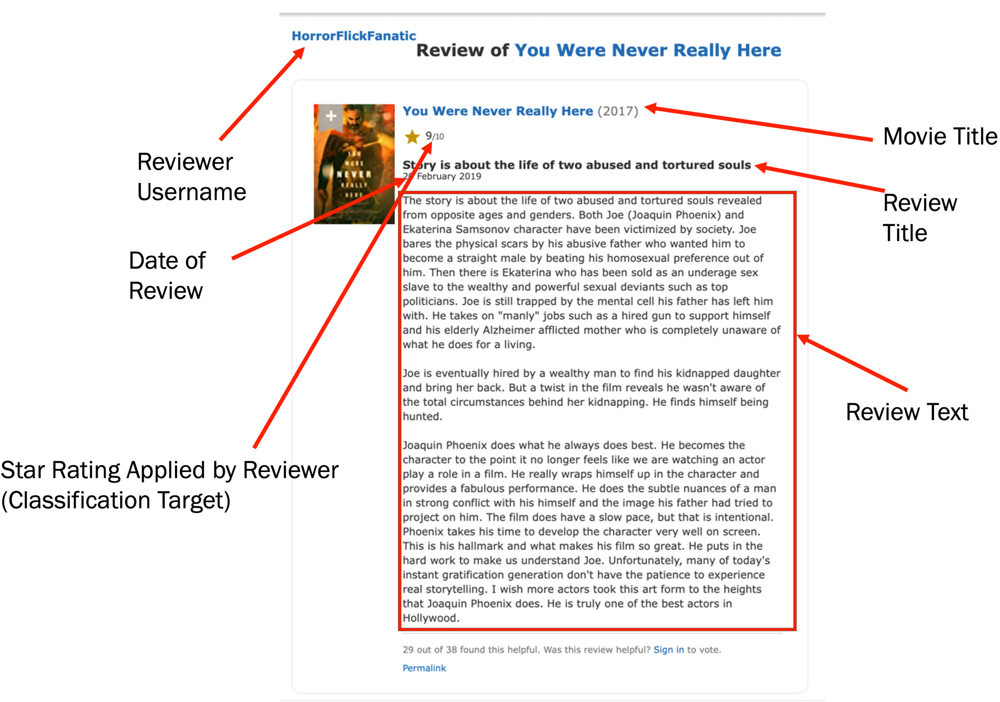
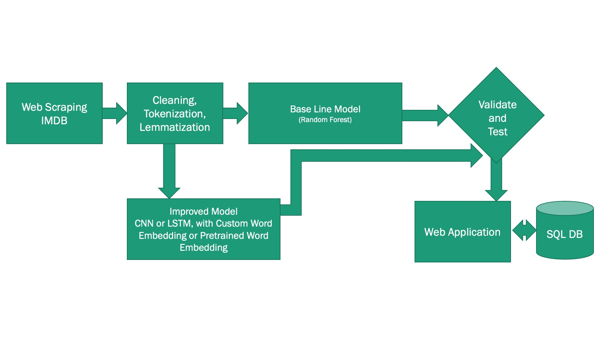

# Sentiment Analysis of IMDB Movie Reviews

This project performs sentiment analysis of IMDB movie reviews and builds a
flask web application that accepts users reviews of a movie and predicts the
net promoter score for that movie review based solely on the text of the
review.

## Description

The project developed custom machine learning models to predict the net
promoter score I user would provide to a review based on sentiment of that
review.

The details of the models developed is documented in the presentation linked below, but
to summarize the following models were developed and their corresponding
accuracy scores are indicated in the table below:

|Model|Test Accuracy|
|-----|-------------|
|Random Forest| 0.55|
|One Dimensional CNN with Custom Word Embedding|0.71|
|Bidirectional LSTM with GloVe Pretrained Word Embedding|0.74|

## Data Used

I scraped 62,612 movie reviews from imdb.com for movies released in the USA anytime between
January 1, 2010 to December 31, 2019.

The image below is one of the reviews I captured with the specific fields I
included in the data set called-out by the red arrows:

## Brief Overview of the NLP Pipeline Used to Perform Sentiment Analysis

The diagram below summarize the NLP pipeline used to process the reviews, and
train and validate the models.

## Tools Used
* python (version 3.8.3)
* jupyter lab (2.2.6)
* bs4 (4.9.1)
* requests (2.24.0)
* sklearn (0.23.2)
* keras 2.4.0
* tensorflow 2.3.1
* NLTK: Perform tokenization (splitting into words) and [lemmatization](https://en.wikipedia.org/wiki/Lemmatisation) of the original text corpus and cleaning (removal of non-English words).
* [Omni Graffle Pro](https://www.omnigroup.com/omnigraffle)
* A PDF file viewer (Acrobat)
* Microsoft Powerpoint
* emacs (or some other preferred text editor)
* matplotlib
* seaborn

## Description of Files
* MyMovieReview.py: Contains classes used to facilitate multi-day scraping and
  quick translation from raw scraped data to a pandas data frame
* Project5.ipynb: Contains the NLP pipeline described above
* get_word_vectors.sh: script that automatically downloads GloVE word
  embeddings from ai.standford.edu
* mymovie.py: Contains classes used to read in an prescraped collection of
  IMDB movie URLs
* project_utils.py: Contains utility functions used throughout the code in
  this project to aid in debug in enable better scraping
* project5_venv.yml: The conda requirements file you can use to directly
  create the the python virtual environment used for this project
* scrape_tool.py: The python script that automatically scraped movie
  reviews. It has some exception handling ability. But it also has the ability
  to pick up where it left off.

## Steps To Reproduce This Project

1. Clone this repo
1. Run this command: `conda env create -f Source/project5_venv.yml`
1. Once that's done and you have activated your virtual environment you should
   be able to start jupyter lab with this command: `jupyter lab`
1. With Jupyter Lab, open the notebook `Source/Project5.ipynb`
1. You should be able to run the cells. Please note that the default settings
   of the notebook require a pkl file of the cleaned data. Please contact me
   if you want that data. 
   
### The Web Application

Running the web application will required the following:

* A setup script to set the application configuration variables that contain
  the credentials to enable the web application to access the remote SQL
  database and to send emails to the admin of the web application. You can
  ask me for a copy of the setup script.
  
Once you have obtained the the setup script you can run the following commands
to launch the web application

1. `cd Source/web_app`
1. `source <setup_script>`
1. `flask run`
   
The fields to enter I estimate are likely self explanatory. If you would like
to see a demo you can download a video here:  _Coming Soon!_

* It saves the transactions you enter into the database so that they could be
  used to re-train the model (and hopefully improve it) over time.
* When you hit the **\[Submit\]** button the web application performs a
  prediction of whether or not the transaction you entered is
  fraudulent. This is highlighted in the demonstration video referenced above
